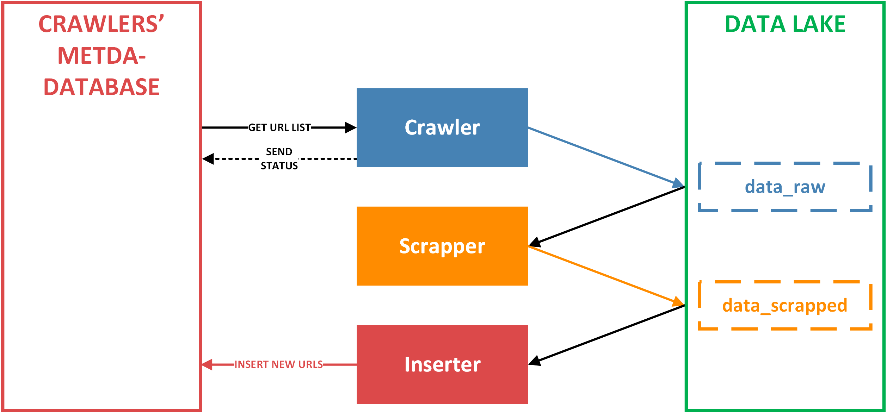

# Scrapper - Crawler Architecture
The goal is to crawl the https://icobench.com/ieo page and collect information about Initial
Exchange Offerings. Program extracts the information about the IEOs into csv and downaloads 
all whitepapers. <br>


## Architecture flow

1. Crawler requests the links from the database. If it crawles and saves the website sucessfully it sends a SUCCESS 
status for the given url, otherwise a FAILURE status. Crawler saves raw htmls in the data_raw directory.
2. Scrapper opens the downloaded files and extracts information and saves it into csv format. The csv files are saved in
the data_scrapped folder
3. There is also optional Inserter, that puts new urls into the datbase. It gets the newly scrapped file and inserts 
urls from it.

There is also a special step called **meta-crawling**. The example of it is a crawler_list.py, 
that given only the initial url, crawles the table to get all other links. These are automatically inserted into the database,
because they are important for further crawling.  
## Data Lake Structure

Data Lake is a folder structure for storing data. 
It distinguishes the data into two categories: raw and scrapped.
Data_raw contains raw htmls, that have the information about: list of all IEOs, profiles and whitepapers of IEOs.  

Data_scrapped has the data extracted from raw htmls, that is saved into CSV files.
Inserter uses those files as a source for new urls to crawl. 
## Database Architecture
The purpose of the database is to store the urls to crawl and also to facilitate fail-recovery. 
It also enhances workflow among crawlers and scrappers, so that the parallelism can be easily implemented. 

I have created an API interface to provide the fail-recovery system and also an efficient communication. <br>
It contains the following functions and procedures:<br>
- **FUNCTION fn_get_ieos(crawler_name URLS.crawler%TYPE)** <br>
Sends the list of urls to crawl that have either status_code FAILURE or NULL<br>

- **PROCEDURE insert_new_urls (
    url urls.url%TYPE,
    crawler urls.crawler%TYPE,
    project_name urls.project%TYPE,
    status_code urls.status_code%TYPE DEFAULT Null,
    SCRAPE_TIME urls.scrape_time%TYPE DEFAULT Null)**<br>
Inserts new links for later crawling <br>
- **PROCEDURE update_urls (
    url_a urls.url%TYPE,
    status_code_a urls.status_code%TYPE ,
    SCRAPE_TIME_a urls.scrape_time%TYPE)**<br>
Updates the status_code and also includes the time-stamp of crawling of the given url<br>


## How to run it:
Prerequisites:
- **You need to have Docker with the docker-compose installed on your machine**

To run the program you just need to run the .bat script, which will execute the following command:
```shell script
docker-compose -f docker\docker-compose\crawler-scrapper-architecture.yml up --build
```

 Post Script:<br>
 All architecture was developed on Linux Ubuntu and was tested on Windows 10. 
