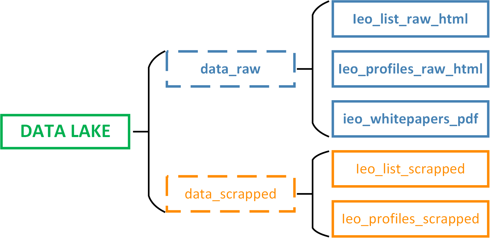

# Scrapper - Crawler Architecture
The goal is to crawl the https://icobench.com/ieo page and collect information about Initial
Exchange Offerings. Itextracts the information about the IEOs into csv and downaloads all related pdfs called whitepapers.  

## Architecture flow

1. Crawler requests the links to scrape from the database. If it crawles the website sucessfully it sends a SUCCESS 
status for the given url, otherwise a FAIL status. Crawler saves raw htmls in the data_raw directory.
2. Scrapper opens the downloaded files and extracts information and saves it into csv format. The csv files are saved in
the data_scrapped folder
3. There is also optional Inserter, that puts new urls into the datbase. It gets the newly scrapped file and inserts 
urls from it.

There is also a special step called **meta-crawling**. The example of it is a crawler_list.py, 
that given only the initial url, crawles the table to get all other links. These will be necessary for later Crawlers.  
## Data Lake Structure

Data Lake is a folder structure for storing data. 
It distinguishes the data into two categories: raw and scrapped.
Data_raw has the raw htmls for list of IEOs, profile of each IEO and also whitepaper for each IEO. 

Data_scrapped has the data extracted from raw, that is saved into CSV files.
## Database Architecture
The purpose of the database is to store the urls to crawl and to facilitate fail-recovery. It also enhances workflow among
crawlers and scrappers.

I have created an API interface for efficient communication between the database and program. It contains
> CREATE FUNCTION fn_get_ieos(crawler_name URLS.crawler%TYPE)  
> Sends the list of urls to crawl that have either status_code FAILURE or NULL

> PROCEDURE insert_new_urls (
    url urls.url%TYPE,
    crawler urls.crawler%TYPE,
    project_name urls.project%TYPE,
    status_code urls.status_code%TYPE DEFAULT Null,
    SCRAPE_TIME urls.scrape_time%TYPE DEFAULT Null) 
> Inserts new links for later crawling 
 
> PROCEDURE update_urls (
    url_a urls.url%TYPE,
    status_code_a urls.status_code%TYPE ,
    SCRAPE_TIME_a urls.scrape_time%TYPE) 
> Updates the status_code and also includes the time-stamp of crawling of the given url

## How to run it

 